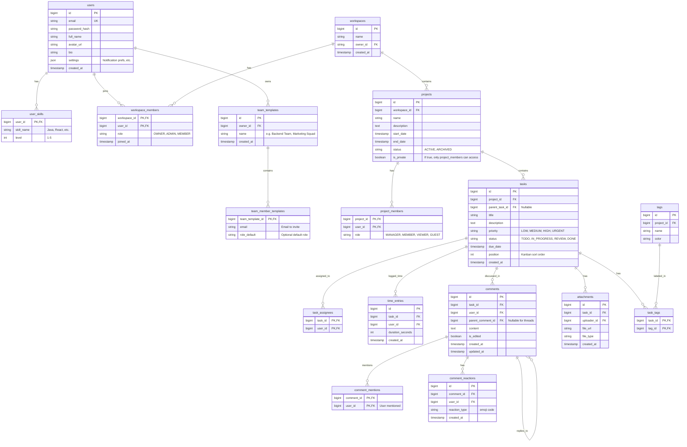

# MVP Entity Relationship Diagram (ERD) - 10-Week Scope

**Chiến lược Rút gọn cho MVP (10 Tuần):**

1.  **Cắt bỏ Module**: Loại bỏ bảng `Permissions` & `Roles` động phức tạp. Sử dụng Hard-coded Enum cho Role (Admin/Member).
2.  **Đơn giản hóa**:
    - Gộp `Skills` quản lý (Master Data) vào text/tag đơn giản hoặc chỉ giữ quan hệ cơ bản.
    - Loại bỏ Custom Workflow (`task_statuses` động theo Project). Sử dụng trạng thái cố định (Todo/In Progress/Review/Done) để giảm logic FE/BE.
    - `Tags`, `Checklists` có thể lưu dạng JSON trong bảng `Tasks` để giảm số lượng bảng cần Join (nếu dùng Postgres/NoSQL), nhưng ở đây giữ bảng riêng để dễ query báo cáo hiệu suất.
3.  **Core Features**: Tập trung vào Task, Assignment, và Time Tracking (cho tính năng đánh giá).

