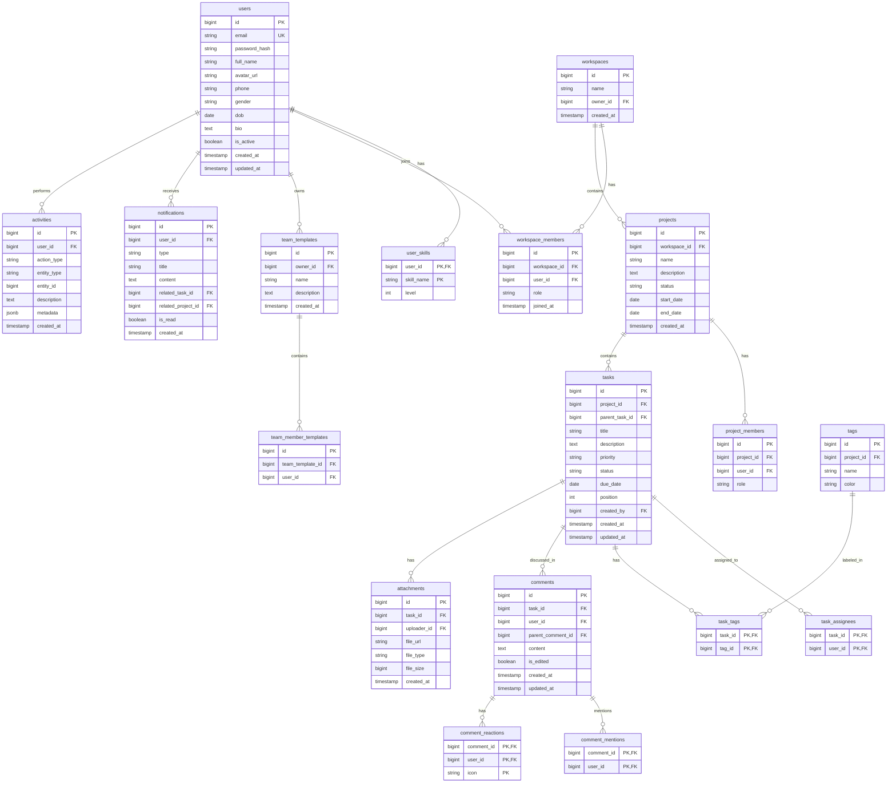
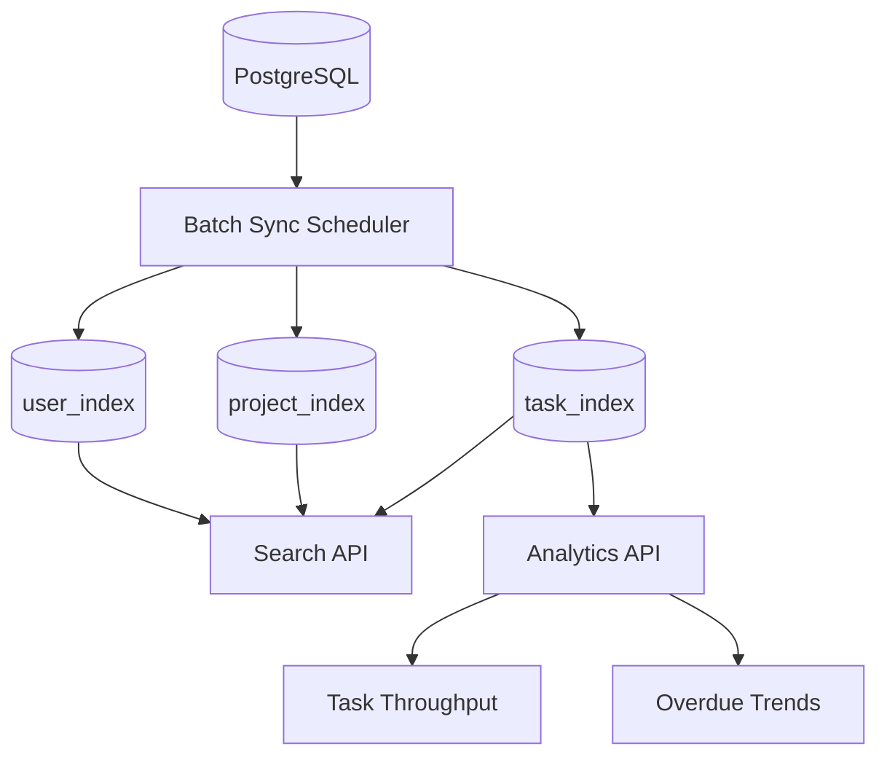

# Entity Relationship Diagram (Aligned Scope)

## 1. Ghi chú thiết kế

- MVP ưu tiên nghiệp vụ cốt lõi cho team 5-15 user.
- Task workflow dùng trạng thái cố định: `TODO`, `IN_PROGRESS`, `REVIEW`, `DONE`.
- Không dùng manual timer/time logging trong MVP.
- Elasticsearch được dùng làm search + analytics store, đồng bộ batch từ PostgreSQL.

---

## 2. Relational ERD (PostgreSQL)

---

## 3. Elasticsearch Index Model (MVP)

### Index phạm vi MVP

- `task_index`: title, description, status, priority, due_date, assignees
- `project_index`: name, description, status
- `user_index`: full_name, skills, role

### Vận hành MVP

- Đồng bộ: batch theo lịch
- Reindex: manual command
- Ngôn ngữ search: tiếng Việt + tiếng Anh

---

## 4. Phase 2 Extensions

- AI retrieval cho chatbot RAG qua Elasticsearch
- Analytics mở rộng: workload by assignee, comment activity
- AI performance evaluation từ activity signals
