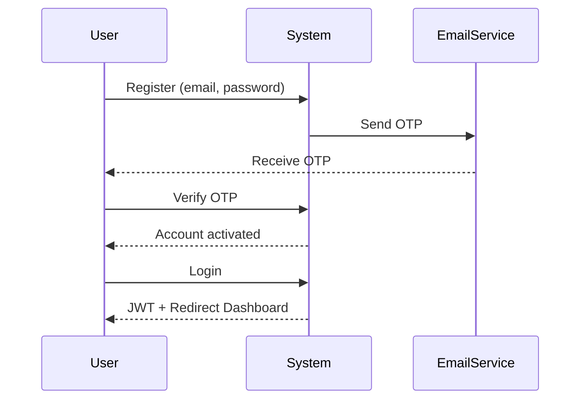
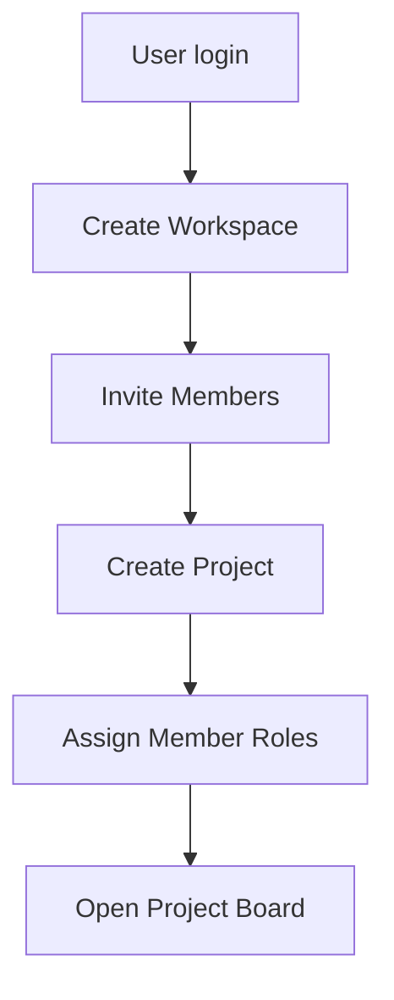
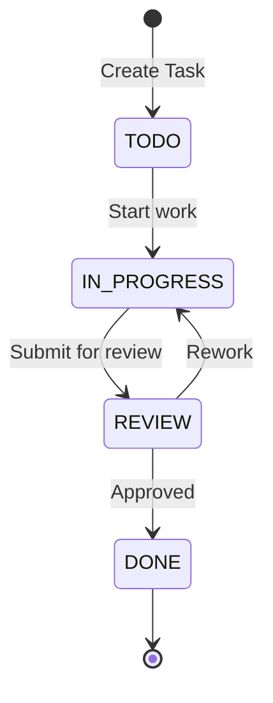
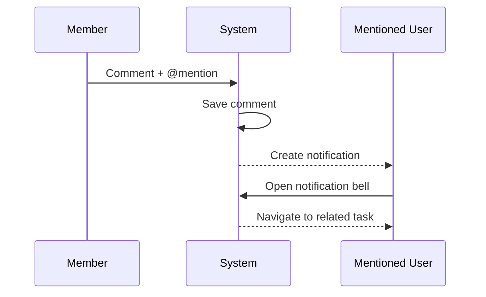
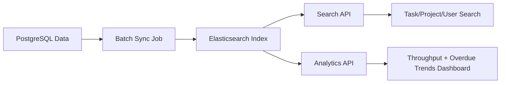

# User Flows & Use Cases (Aligned Scope)

Tài liệu này mô tả user flows theo phiên bản đã thống nhất:

- Target: team nhỏ 5-15 user, có Workspace layer
- MVP: không AI trực tiếp
- Phase 2: AI nâng cao
- Elasticsearch: search + analytics trong MVP

## 1. Actors

| Actor                  | Mô tả             | Quyền chính                                        |
| :--------------------- | :---------------- | :------------------------------------------------- |
| Workspace Owner        | Chủ workspace     | Quản lý workspace/member/project cấp cao           |
| Manager                | Quản lý dự án     | Quản lý task, member, dashboard                    |
| Member                 | Thành viên        | Thực hiện task, comment, upload file               |
| Viewer                 | Người xem         | Chỉ xem thông tin theo quyền                       |
| System Scheduler       | Tác nhân hệ thống | Batch sync PostgreSQL -> Elasticsearch             |
| AI Assistant (Phase 2) | Tác nhân AI       | Smart Assign, Subtask Gen, Chatbot, Performance AI |

---

## 2. Core User Flows (MVP)

### 2.1 Authentication & Onboarding

### 2.2 Workspace & Project Setup

### 2.3 Task Lifecycle (Fixed Status)

### 2.4 Collaboration + Notification

### 2.5 Search & Analytics (Elasticsearch)

---

## 3. Phase 2 Flows (AI)

### 3.1 AI Smart Assign

- Input: task context + user skill/activity profile
- Output: danh sách assignee đề xuất

### 3.2 AI Auto Subtask Generation

- Input: mô tả task lớn
- Output: danh sách subtasks/checklist gợi ý

### 3.3 AI Chatbot (RAG)

- Retrieval: Elasticsearch
- Generation: LLM response theo ngữ cảnh dự án

### 3.4 AI Performance Evaluation

- Input: activity signals
- Output: đánh giá xu hướng hiệu suất và cảnh báo

---

## 4. Use Case Index (Rút gọn)

- UC01-UC04: Auth & Profile
- UC05-UC08: Workspace & Project
- UC09-UC13: Task, Collaboration, Notification
- UC14-UC17: Search & Analytics (Elasticsearch)
- UC18-UC21: AI Features (Phase 2)
