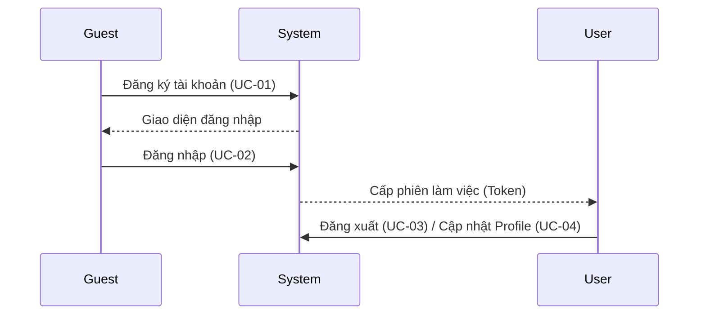
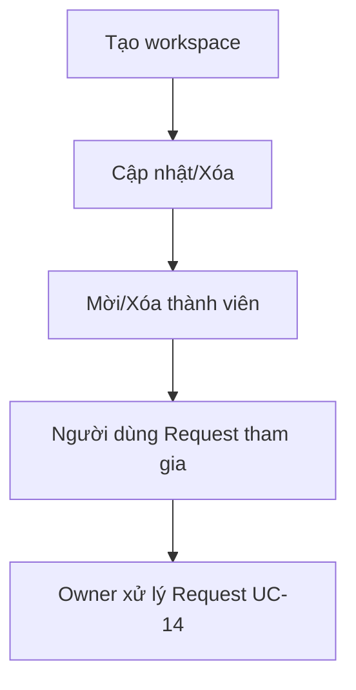
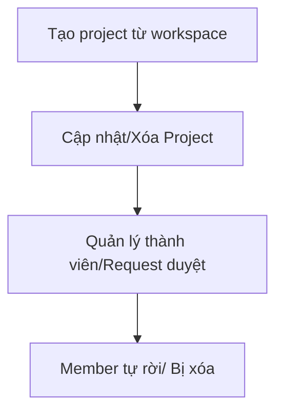
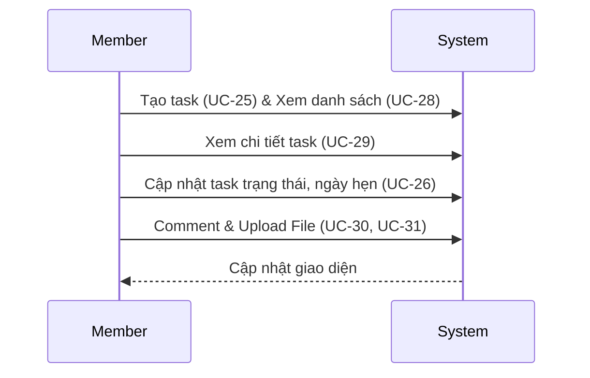
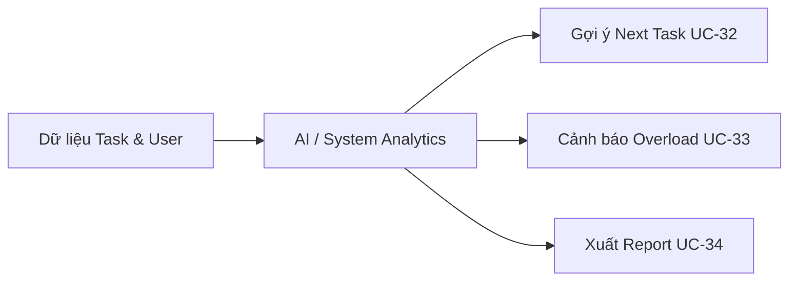
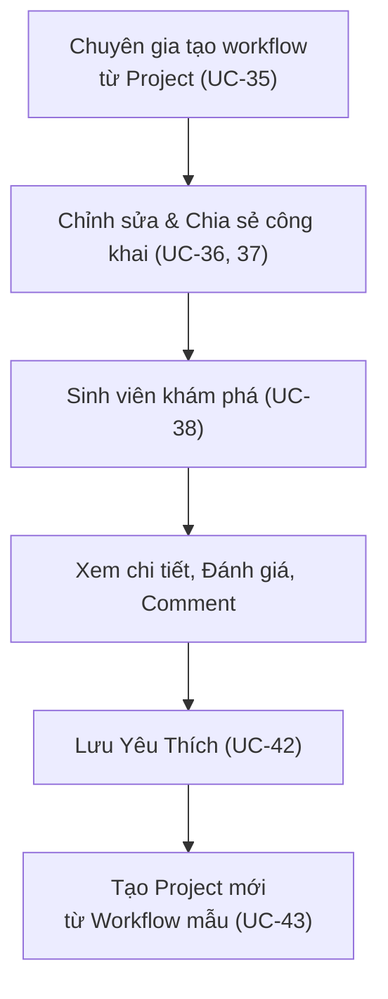
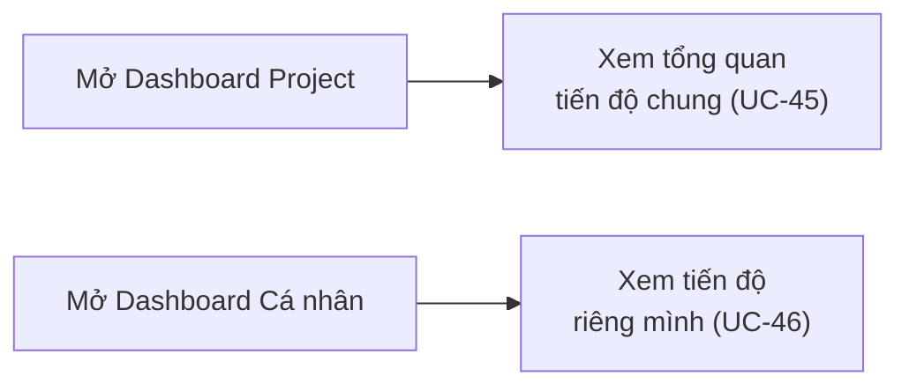

# User Flows & Use Cases (Synced with UC-01 .. UC-46 from Documents.md)

Tài liệu mô tả các luồng người dùng dự trên bộ 46 Use Cases mới nhất do có thay đổi về quy hoạch tính năng.

## 1. Actors

| Actor           | Mô tả                  | Quyền chính                                              |
| :-------------- | :--------------------- | :------------------------------------------------------- |
| Guest           | Người chưa đăng nhập   | Đăng ký, đăng nhập                                       |
| User            | Người dùng đã xác thực | Cập nhật hồ sơ, quản lý workspace/project, thực thi task |
| Workspace Owner | Chủ workspace          | Quản lý không gian làm việc và nhân sự cấp cao           |
| Project Manager | Điều hành project      | Quản lý tiến độ, báo cáo, phân bổ nhân lực               |
| Project Member  | Thành viên thực thi    | Làm task, comment, upload file                           |
| Contributor     | Người đóng góp nổi bật | Tạo và chia sẻ workflow chuẩn cộng đồng                  |
| AI Engine       | Tác nhân AI            | Đề xuất task, theo dõi rủi ro overload                   |

---

## 2. Core User Flows

### 2.1 Account Access Flow

**Mapped UC**: UC-01, UC-02, UC-03, UC-04

### 2.2 Workspace Membership Flow

**Mapped UC**: UC-05 đến UC-14

### 2.3 Project Membership Flow

**Mapped UC**: UC-15 đến UC-24

### 2.4 Task & Collaboration Flow

**Mapped UC**: UC-25 đến UC-31 (Đã merge Flow comment và tag)

### 2.5 AI & Reporting

**Mapped UC**: UC-32, UC-33, UC-34

### 2.6 Workflow Knowledge Sharing Flow (Vốn tri thức)

**Mapped UC**: UC-35 đến UC-44

### 2.7 Dashboard

**Mapped UC**: UC-45, UC-46

---

## 3. Use Case Index (Full 46)

- UC-01 .. UC-04: Account & Profile
- UC-05 .. UC-14: Workspace Management
- UC-15 .. UC-24: Project Management
- UC-25 .. UC-31: Task & Collaboration
- UC-32 .. UC-33: AI Business Support
- UC-34: Reporting
- UC-35 .. UC-44: Workflow Knowledge Sharing (Template)
- UC-45 .. UC-46: Dashboards
