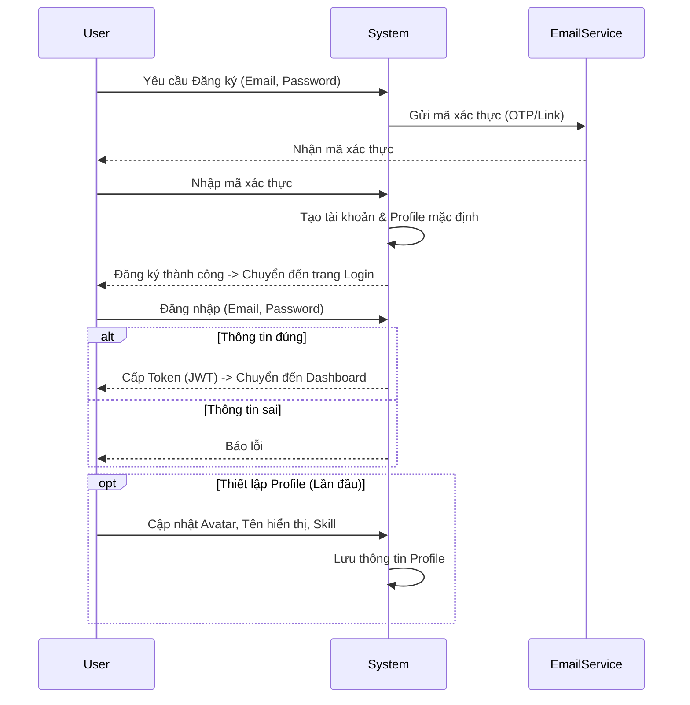
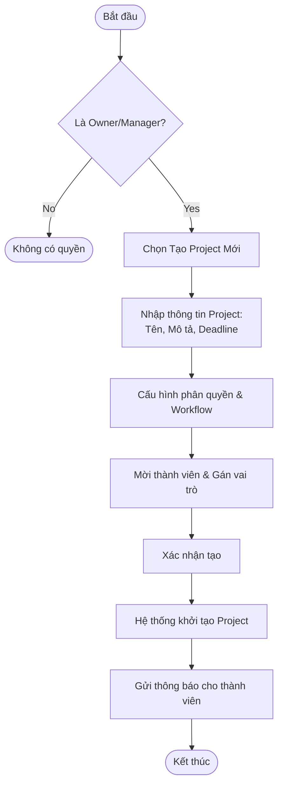
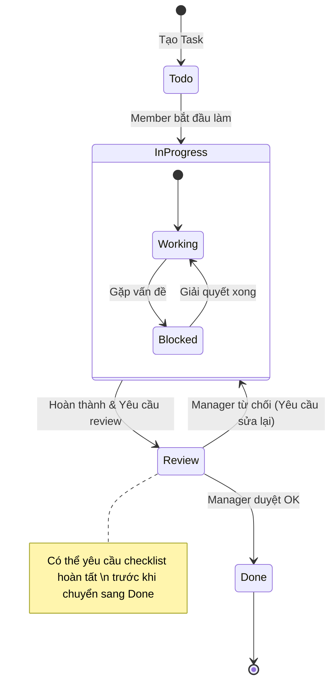
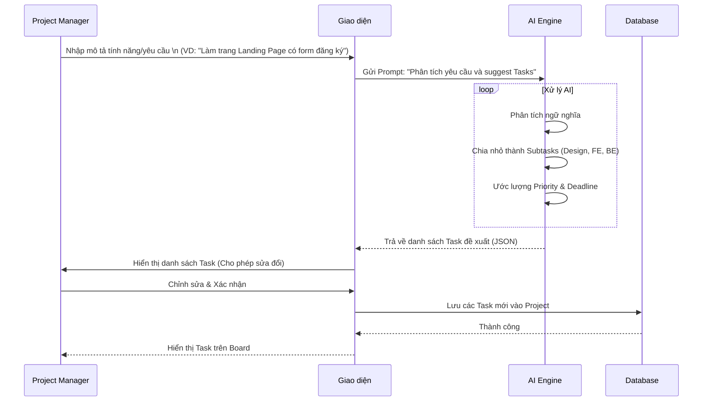

# User Flows & Use Cases

Tài liệu này mô tả các luồng người dùng (User Flows) và các trường hợp sử dụng (Use Cases) chính của hệ thống, dựa trên định hướng phát triển phần mềm quản lý công việc và đánh giá hiệu suất.

## 1. Actors (Tác nhân)

Hệ thống được thiết kế cho mô hình Single Instance (Enterprise), với các nhóm người dùng chính sau:

| Actor               | Mô tả                             | Quyền hạn chính                                                                             |
| :------------------ | :-------------------------------- | :------------------------------------------------------------------------------------------ |
| **Workspace Owner** | Người sở hữu không gian làm việc. | Toàn quyền quản lý Workspace, cấu hình hệ thống, quản lý người dùng cấp cao nhất.           |
| **Project Manager** | Quản lý dự án.                    | Tạo/Sửa/Xóa project, phân quyền thành viên trong project, theo dõi tiến độ, quản lý task.   |
| **Member**          | Thành viên thông thường.          | Thực hiện task được giao, tạo task (nếu được phép), cập nhật trạng thái, comment, log work. |
| **Viewer**          | Người xem (Khách/Stakeholder).    | Chỉ xem thông tin project/task, không có quyền chỉnh sửa.                                   |
| **AI Assistant**    | Hệ thống AI.                      | Hỗ trợ tạo task, tóm tắt, gợi ý, cảnh báo rủi ro.                                           |

---

## 2. Core User Flows (Luồng người dùng cốt lõi)

### 2.1. Authentication & Onboarding

Luồng đăng ký, đăng nhập và thiết lập hồ sơ ban đầu.

### 2.2. Project & Workspace Management

Luồng tạo mới không gian làm việc và dự án.

### 2.3. Task Management Lifecycle

Vòng đời của một công việc từ khi tạo đến khi hoàn thành.

### 2.4. AI-Assisted Task Creation

Luồng sử dụng AI để phân tích yêu cầu từ ngôn ngữ tự nhiên thành các task cụ thể.

---

## 3. Detailed Use Cases List

### 3.1. Quản lý Tài khoản (Auth)

- **UC01 - Đăng ký/Đăng nhập**: Người dùng truy cập hệ thống bằng email/password hoặc SSO.
- **UC02 - Quên mật khẩu**: Khôi phục quyền truy cập qua email.
- **UC03 - Cập nhật hồ sơ**: User cập nhật avatar, skill set (phục vụ việc AI gợi ý người làm).

### 3.2. Quản lý Workspace & Project

- **UC04 - Tạo Workspace**: Khởi tạo không gian làm việc chung (thường cho Admin cài đặt lần đầu).
- **UC05 - Quản lý thành viên**: Mời người dùng vào Workspace, phân quyền (Role-based).
- **UC06 - Tạo Project**: Thiết lập dự án mới, config workflow (Status, Label).
- **UC07 - Dashboard tổng quan**: Xem tiến độ dự án qua các biểu đồ (Burndown chart, Task distribution).

### 3.3. Quản lý Task (Công việc)

- **UC08 - Tạo Task thủ công**: Nhập tiêu đề, mô tả rich text, assign, due date.
- **UC09 - Cập nhật trạng thái**: Kéo thả task trên Kanban hoặc đổi status trong Detail view.
- **UC10 - Log Work**: Ghi nhận thời gian làm việc (Time tracking) -> _Dữ liệu đầu vào cho đánh giá hiệu suất_.
- **UC11 - Bình luận & Đính kèm**: Trao đổi trực tiếp trên task, upload tài liệu liên quan.

### 3.4. Tính năng AI

- **UC12 - AI Generate Tasks**: Tạo nhanh danh sách công việc từ mô tả vắn tắt.
- **UC13 - AI Summarize**: Tóm tắt nội dung thảo luận dài trong task comment.
- **UC14 - AI Warning**: Cảnh báo task có nguy cơ trễ hạn dựa trên tiến độ và lịch sử.

### 3.5. Chế độ xem (Views)

- **UC15 - Kanban View**: Xem task dạng thẻ theo cột trạng thái.
- **UC16 - Calendar View**: Xem task theo lịch (deadline, timeline).
- **UC17 - Gantt/Timeline View**: Xem sự phụ thuộc và lộ trình dự án.
