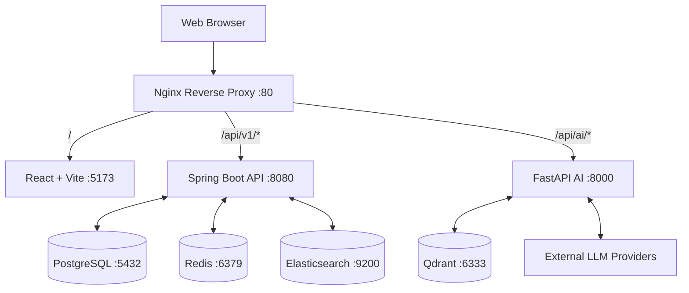

<div align="center">
  <!-- TODO: Add logo image -->
  <!--  -->
  
  <h1>TaskSense</h1>
  
  <p>
    <strong>Intelligent Workspace-based Project Management Application</strong>
  </p>

  <p>
    <a href="https://reactjs.org/"></a>
    <a href="https://spring.io/projects/spring-boot"></a>
    <a href="https://www.postgresql.org/"></a>
    <a href="https://www.docker.com/"></a>
    <a href="https://fastapi.tiangolo.com/"></a>
  </p>

  <p>
    <em>A microservices-based collaboration platform designed for small to medium teams (5-15 members), featuring robust task management, real-time collaboration, and AI-powered productivity tools.</em>
  </p>
</div>

---

## 📸 Sneak Peek

> **Note:** Replace the image path below with actual screenshots or a demo GIF.

<div align="center">
  
</div>

## ✨ Key Features

TaskSense is delivered in two main phases, offering a seamless progression from core project management to advanced AI capabilities.

### Core Capabilities (Phase 1)
* 🏢 **Workspace & Project Management**: Organize teams with workspaces, projects, and role-based access control (RBAC).
* 📋 **Advanced Kanban Boards**: Drag-and-drop task management with flexible workflows (TODO, IN_PROGRESS, REVIEW, DONE).
* 💬 **Real-time Collaboration**: In-app comments, `@mentions`, and instant notification bells.
* 🔍 **Powerful Search & Analytics**: Elasticsearch integration for full-text search across tasks/projects (VI + EN) and KPI dashboards.
* 📁 **File Management**: Secure attachment uploads backed by MinIO (S3-compatible).

### AI-Powered Extensions (Phase 2)
* 🤖 **AI Smart Assign**: Automatically suggest the best team member for a task based on workload and expertise.
* ⚡ **Auto Subtask Generation**: Break down complex tasks into manageable subtasks instantly via LLMs.
* 💬 **AI Chatbot (RAG)**: Ask questions about project context, retrieving accurate answers powered by Elasticsearch & Qdrant.
* 📊 **Performance Evaluation**: AI-driven developer performance insights derived from activity signals (commits, comments, task velocity).

## 🛠 Tech Stack

TaskSense follows a robust **Microservices Architecture** ensuring scalability and performance.

### Frontend (`/client`)
* **Framework**: React 19 + Vite
* **Language**: TypeScript
* **State Management**: Redux Toolkit & RTK Query
* **Styling**: TailwindCSS & shadcn/ui

### Backend API (`/server`)
* **Framework**: Spring Boot 3 (Java 21)
* **Data Access**: Spring Data JPA, Hibernate
* **Database Migrations**: Flyway

### AI Service (`/ai`)
* **Framework**: FastAPI (Python 3.13)
* **AI Orchestration**: LangChain
* **LLM Integration**: OpenAI / Google Gemini / OpenRouter

### Infrastructure (`/infra`)
* **Relational DB**: PostgreSQL 16
* **Cache & Sessions**: Redis 7
* **Search Engine**: Elasticsearch 9.0
* **Vector DB**: Qdrant (for RAG)
* **Reverse Proxy**: Nginx Alpine
* **Containerization**: Docker & Docker Compose

## 🏗 Architecture Overview



## 🚀 Getting Started

To get a local copy up and running, follow these simple steps.

### Prerequisites
* Docker Desktop & Docker Compose v2
* Java 21 (JDK), Node.js 20+, Python 3.13+ (for local development)
* Git

### Quick Start (Production/Staging Mode)

1. **Clone the repository**
   ```sh
   git clone https://github.com/Alro127/TaskSense.git
   cd TaskSense
   ```

2. **Configure Environment Variables**
   ```sh
   cd infra/docker
   cp ../../.env.example .env
   ```
   *Edit `.env` to add your `SECURITY_JWT_SECRET`, Google OAuth keys, and AI Provider keys.*

3. **Spin up the system**
   ```sh
   docker compose up -d --build
   ```
   *The application will be accessible at `http://localhost`.*

> 📖 **For detailed local development instructions, see our [Full Installation Guide](docs/INSTALLATION_GUIDE.md).**

## 📚 Documentation Directory

Explore the `docs/` folder for in-depth system information:

* [**Project Plan & Scope**](docs/ProjectPlan.md) - Detailed phase strategies and sprints.
* [**Installation Guide**](docs/INSTALLATION_GUIDE.md) - Comprehensive setup for Dev/Prod environments.
* [**Docker Architecture**](docs/DOCKER_ARCHITECTURE.md) - Deep dive into containerized infrastructure.

